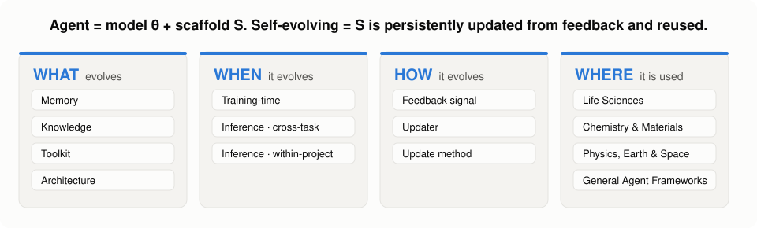
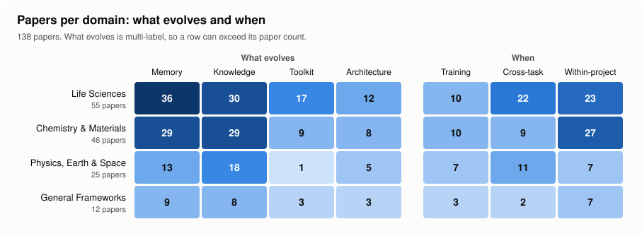

<h1 align="center">🧪 Awesome Self-Evolving Scientific Agents</h1>

<b>LLM agents that get better at science by learning from their own research.</b>

  <picture>
    <source media="(prefers-color-scheme: dark)" srcset="assets/taxonomy-dark.svg">
    
  </picture>

This repository collects work on **self-evolving LLM agents in the natural sciences**: systems whose memory, knowledge, tools, or own architecture improve from their research experience and carry over to later decisions. Every entry was screened against an explicit inclusion rule and labeled with a four-question taxonomy. If you know of a paper we missed, please open an issue or a pull request!

## 📢 News

- **[2026-10]** 🎉 Repository launched with **139 papers**, each labeled by what evolves, when, how, and where.

## 📑 Contents

- [🔍 What counts as self-evolving](#-what-counts-as-self-evolving)
- [📐 Taxonomy](#-taxonomy)
- [📊 At a glance](#-at-a-glance)
- [📚 Paper list](#-paper-list)
  - [🧬 Life Sciences](#-life-sciences) (56)
  - [🔬 Chemistry & Materials](#-chemistry--materials) (45)
  - [🌌 Physics, Earth & Space Sciences](#-physics-earth--space-sciences) (25)
  - [🧭 General Scientific Agent Frameworks](#-general-scientific-agent-frameworks) (13)
- [🤝 Contributing](#-contributing)

## 🔍 What counts as self-evolving

We view an agent as a **model θ plus a scaffold S**: memory, knowledge, tools, prompts, workflows, multi-agent organization, and the agent's own code. A paper is included when an LLM agent working on a natural-science research task

1. **writes back** part of its scaffold S persistently,
2. driven by **feedback** from its own execution, experiments, evaluations, or researchers, and
3. **reads the updated state again** in later decisions.

<b>What is not included</b>

- **Candidate-only evolution**: only the solutions evolve (programs, molecules, equations) while the agent stays the same, as in FunSearch/AlphaEvolve-style loops.
- **Weights-only updates**: RL or SFT of the model with no persistent scaffold state.
- **Read-only retrieval**, **single-run retries**, and **extra inference compute** (sampling, voting, tree search).
- **Out of scope tasks**: engineering design (devices, lenses, control laws), AI/ML research, pure mathematics, social science, and clinical medicine. Design of quantum control protocols and quantum error-correcting codes counts as physics.

## 📐 Taxonomy

| Question | Labels |
|---|---|
| **What evolves** | 🗂️ **Memory**: concrete cases, trajectories, experiment records · 💡 **Knowledge**: rules, mechanisms, hypotheses distilled from many cases · 🛠️ **Toolkit**: executable tools, functions, procedures · 🏗️ **Architecture**: prompts, workflows, team topology, the agent's own code |
| **When** | `training-time`: built in a dedicated phase, then frozen · `cross-task`: grows during use and carries over to new tasks · `within-project`: persists across rounds of one research project |
| **How** | *Feedback signal*: formal verification, code execution, simulation, datasets & benchmarks, literature, LLM judge, human expert, wet lab & instruments · *Update method*: direct recording, reflection & summarization, imitation & distillation, search & evolution, optimization, RL |
| **Where** | 🧬 Life Sciences · 🔬 Chemistry & Materials · 🌌 Physics, Earth & Space · 🧭 General Scientific Agent Frameworks (evaluated in two or more domains) |

Flags: `shared` several agents read and write the same evolving artifact · `+weights` model weights are updated as well · `LLM-as-operator` the LLM proposes inside a fixed loop while scaffold state still evolves.

## 📊 At a glance

  <picture>
    <source media="(prefers-color-scheme: dark)" srcset="assets/stats-dark.svg">
    
  </picture>

## 📚 Paper list

Papers are grouped by domain, then by the deepest component that evolves (Architecture › Toolkit › Knowledge › Memory). Tags list everything that evolves, when it evolves, and flags. Newest first. All labels, including feedback signals and update methods, are in [`data/papers.csv`](data/papers.csv).

### 🧬 Life Sciences

<b>🏗️ Architecture</b> (11) · <i>agents that rewrite their own prompts, workflows, team structure, or code</i>

- (*KDD'26*) **VCAgent**: A Mutation-Guided Self-Reflective Agent Framework for Virtual Cell Modeling [[📝 Paper](https://doi.org/10.1145/3770855.3818989)] `Architecture` `training-time` `LLM-as-operator`
- (*arXiv'26*) **SIA**: Self Improving AI with Harness & Weight Updates [[📝 Paper](https://arxiv.org/abs/2605.27276)] `Toolkit` `Architecture` `within-project` `+weights`
- (*arXiv'26*) **AutoScientists**: Self-Organizing Agent Teams for Long-Running Scientific Experimentation [[📝 Paper](https://arxiv.org/abs/2605.28655)] `Memory` `Knowledge` `Architecture` `within-project` `shared`
- (*arXiv'26*) **MAC-AMP**: A Closed-Loop Multi-Agent Collaboration System for Multi-Objective Antimicrobial Peptide Design [[📝 Paper](https://arxiv.org/abs/2602.14926)] `Memory` `Toolkit` `Architecture` `within-project` `shared` `+weights` `LLM-as-operator`
- (*bioRxiv'26*) A Persistent Fleet of AI Scientists Exhibits Cooperative and Autopoietic Behavior [[📝 Paper](https://doi.org/10.64898/2026.08.16.745122)] `Memory` `Knowledge` `Architecture` `cross-task` `shared`
- (*arXiv'25*) **The Station**: An Open-World Environment for AI-Driven Discovery [[📝 Paper](https://arxiv.org/abs/2511.06309)] `Memory` `Knowledge` `Toolkit` `Architecture` `within-project` `shared`
- (*arXiv'25*) **RareAgent**: Self-Evolving Reasoning for Drug Repurposing in Rare Diseases [[📝 Paper](https://arxiv.org/abs/2510.05764)] `Knowledge` `Architecture` `cross-task`
- (*arXiv'25*) Hypothesis Hunting with Evolving Networks of Autonomous Scientific Agents [[📝 Paper](https://arxiv.org/abs/2510.08619)] `Memory` `Architecture` `within-project` `shared`
- (*arXiv'25*) **TusoAI**: Agentic Optimization for Scientific Methods [[📝 Paper](https://arxiv.org/abs/2509.23986)] `Memory` `Architecture` `within-project` `LLM-as-operator`
- (*Nature'25*) **Robin**: A multi-agent system for automating scientific discovery [[📝 Paper](https://arxiv.org/abs/2505.13400)] `Memory` `Knowledge` `Architecture` `within-project`
- (*Nature'25*) Accelerating scientific discovery with Co-Scientist [[📝 Paper](https://arxiv.org/abs/2502.18864)] `Knowledge` `Architecture` `within-project` `shared`

<b>🛠️ Toolkit</b> (14) · <i>agents that build and refine executable tools and procedures</i>

- (*arXiv'26*) **Vestrum**: Improving Agent Harnesses by Adapting Their Verification, Structure and Memory [[📝 Paper](https://arxiv.org/abs/2609.33822)] `Knowledge` `Toolkit` `training-time`
- (*arXiv'26*) **LabAgent**: Customize Any Research Hubs for Scientific Discoveries Using AI Agents [[📝 Paper](https://arxiv.org/abs/2609.13437)] `Memory` `Toolkit` `training-time`
- (*KDD'26*) **SpaCellAgent**: A Self-Evolving LLM-Based Multi-Agent Framework for Trajectory Analysis [[📝 Paper](https://arxiv.org/abs/2607.07467)] `Memory` `Toolkit` `cross-task`
- (*medRxiv'26*) **ReCo**: a self-configuring and self-extending agentic framework for biomedical research [[📝 Paper](https://doi.org/10.64898/2026.07.14.26358025)] `Toolkit` `cross-task`
- (*arXiv'26*) **PRAXIS**: Case-distilled and code-verified AI agents for biological research [[📝 Paper](https://arxiv.org/abs/2605.23169)] `Memory` `Knowledge` `Toolkit` `training-time`
- (*arXiv'26*) **DrugSAGE**: Self-evolving Agent Experience for Efficient State-of-the-Art Drug Discovery [[📝 Paper](https://arxiv.org/abs/2605.15461)] `Memory` `Toolkit` `training-time`
- (*arXiv'26*) Self-evolving AI agents for protein discovery and directed evolution [[📝 Paper](https://arxiv.org/abs/2603.27303)] `Toolkit` `cross-task` `shared`
- (*bioRxiv'26*) **PantheonOS**: An Evolvable Multi-Agent Framework for Automatic Genomics Discovery [[📝 Paper](https://doi.org/10.64898/2026.02.26.707870)] `Toolkit` `Knowledge` `cross-task`
- (*bioRxiv'25*) **LabOS**: The AI-XR Co-Scientist That Sees and Works With Humans [[📝 Paper](https://arxiv.org/abs/2510.14861)] `Memory` `Toolkit` `cross-task` `shared`
- (*arXiv'25*) **ToolUniverse**: An open platform for democratizing AI scientists [[📝 Paper](https://arxiv.org/abs/2509.23426)] `Toolkit` `training-time`
- (*Nature'25*) **Paper2Agent**: Reimagining Research Papers As Interactive and Reliable AI Agents [[📝 Paper](https://arxiv.org/abs/2509.06917)] `Toolkit` `training-time`
- (*bioRxiv'25*) **STELLA**: Towards a Biomedical World Model with Self-Evolving Multimodal Agents [[📝 Paper](https://doi.org/10.1101/2025.07.01.662467)] `Knowledge` `Toolkit` `cross-task` `shared` `+weights`
- (*arXiv'25*) **STELLA**: Self-Evolving LLM Agent for Biomedical Research [[📝 Paper](https://arxiv.org/abs/2507.02004)] `Knowledge` `Toolkit` `cross-task` `shared`
- (*Advanced Science 2025*) Autonomous self-evolving research on biomedical data: the DREAM paradigm [[📝 Paper](https://arxiv.org/abs/2407.13637)] `Toolkit` `cross-task`

<b>💡 Knowledge</b> (19) · <i>agents that distill rules, mechanisms, and hypotheses</i>

- (*Machine Learning: Science and Technology 2026*) An autonomous agentic framework for cross-campaign generalization and sensor shift adaptation [[📝 Paper](https://doi.org/10.1088/2632-2153/ae9fb7)] `Memory` `Knowledge` `cross-task`
- (*arXiv'26*) **SSE-Bio**: A Structured Self-Evolving Agent with Agentic Retrieval Policy for Multi-Hop Biomedical Reasoning [[📝 Paper](https://arxiv.org/abs/2608.22132)] `Knowledge` `training-time` `+weights`
- (*arXiv'26*) **AgentFold**: Closed-Loop Agentic Search for Protein Folding Model Design [[📝 Paper](https://arxiv.org/abs/2608.26747)] `Memory` `Knowledge` `within-project` `shared`
- (*arXiv'26*) Accelerating Scientific Research with Gemini in the Real-World [[📝 Paper](https://arxiv.org/abs/2608.26701)] `Knowledge` `within-project`
- (*arXiv'26*) **Networked Intelligence**: Active Shared Context Graphs for Human-AI Team Science [[📝 Paper](https://arxiv.org/abs/2607.13220)] `Memory` `Knowledge` `within-project` `shared`
- (*arXiv'26*) Autonomous Scientific Discovery via Iterative Meta-Reflection [[📝 Paper](https://arxiv.org/abs/2607.01131)] `Memory` `Knowledge` `within-project`
- (*arXiv'26*) **Agri-SAGE**: Simulation-Grounded Multi-Agent LLM for Context-Aware Agricultural Advisory Generation [[📝 Paper](https://arxiv.org/abs/2607.00454)] `Memory` `Knowledge` `cross-task`
- (*arXiv'26*) Process-Reward Tactic Evolution for Long-Horizon Bioinformatics Workflows [[📝 Paper](https://arxiv.org/abs/2606.20839)] `Knowledge` `training-time`
- (*arXiv'26*) A Self-Evolving Agentic System for Automated Generation and Execution of Biological Protocols [[📝 Paper](https://arxiv.org/abs/2606.31763)] `Memory` `Knowledge` `cross-task`
- (*bioRxiv'26*) **SpatialClaw**: A Memory-Augmented Autonomous Ecosystem for Spatial Omics Analysis [[📝 Paper](https://doi.org/10.64898/2026.05.21.723451)] `Memory` `Knowledge` `cross-task`
- (*arXiv'26*) **MDAgent**: A Multi-Agent Framework for End-to-End Molecular Dynamics Research [[📝 Paper](https://arxiv.org/abs/2604.18622)] `Memory` `Knowledge` `training-time` `shared`
- (*arXiv'26*) Can AI Scientist Agents Learn from Lab-in-the-Loop Feedback? Evidence from Iterative Perturbation Discovery [[📝 Paper](https://arxiv.org/abs/2603.26177)] `Knowledge` `within-project`
- (*bioRxiv'26*) An AI-Native Biofoundry for Autonomous Enzyme Engineering: Integrating Active Learning with Automated Experimentation [[📝 Paper](https://doi.org/10.64898/2026.02.01.703093)] `Knowledge` `within-project`
- (*arXiv'26*) **MARBLE**: Multi-Agent Reasoning for Bioinformatics Learning and Evolution [[📝 Paper](https://arxiv.org/abs/2601.14349)] `Memory` `Knowledge` `within-project`
- (*arXiv'25*) Swarms of Large Language Model Agents for Protein Sequence Design with Experimental Validation [[📝 Paper](https://arxiv.org/abs/2511.22311)] `Memory` `Knowledge` `within-project` `shared` `LLM-as-operator`
- (*arXiv'25*) **Kosmos**: An AI Scientist for Autonomous Discovery [[📝 Paper](https://arxiv.org/abs/2511.02824)] `Memory` `Knowledge` `within-project` `shared`
- (*bioRxiv'25*) **OriGene**: A Self-Evolving Virtual Disease Biologist Automating Therapeutic Target Discovery [[📝 Paper](https://doi.org/10.1101/2025.06.03.657658)] `Knowledge` `cross-task`
- (*bioRxiv'25*) **Agentic Lab**: An Agentic-physical AI system for cell and organoid experimentation and manufacturing [[📝 Paper](https://doi.org/10.1101/2025.11.11.686354)] `Memory` `Knowledge` `cross-task` `shared`
- (*ICLR'25*) **BioDiscoveryAgent**: An AI Agent for Designing Genetic Perturbation Experiments [[📝 Paper](https://arxiv.org/abs/2405.17631)] `Knowledge` `within-project`

<b>🗂️ Memory</b> (12) · <i>agents that accumulate cases, trajectories, and experiment records</i>

- (*bioRxiv'26*) Harnessing AI to Build Virtual Cells [[📝 Paper](https://doi.org/10.64898/2026.04.11.717183)] `Memory` `within-project`
- (*arXiv'26*) **BioDyad**: Synchronize Biomedical Discovery and Machine Learning Engineering [[📝 Paper](https://arxiv.org/abs/2609.31939)] `Memory` `within-project`
- (*arXiv'26*) **ADMET-EvO**: a self-evolving scientific agent for sustained research across heterogeneous tasks [[📝 Paper](https://arxiv.org/abs/2609.10121)] `Memory` `within-project` `env-evolving`
- (*arXiv'26*) **EasyBCI Agent**: Towards Universal Neural Data Preprocessing for Brain-Computer Interfaces [[📝 Paper](https://arxiv.org/abs/2607.29007)] `Memory` `cross-task`
- (*arXiv'26*) **HarmonyCell**: Automating Single-Cell Perturbation Modeling under Semantic and Distribution Shifts [[📝 Paper](https://arxiv.org/abs/2603.01396)] `Memory` `cross-task`
- (*Nature Biomedical Engineering 2026*) Empowering AI data scientists using a multi-agent LLM framework with self-evolving capabilities for autonomous, tool-aware biomedical data analyses [[📝 Paper](https://doi.org/10.1038/s41551-026-01634-6)] `Memory` `cross-task`
- (*arXiv'26*) **ASI-Evolve**: AI Accelerates AI [[📝 Paper](https://arxiv.org/abs/2603.29640)] `Memory` `within-project` `LLM-as-operator`
- (*bioRxiv'26*) Using a GPT-5-driven autonomous lab to optimize the cost and titer of cell-free protein synthesis [[📝 Paper](https://doi.org/10.64898/2026.02.05.703998)] `Memory` `within-project`
- (*arXiv'25*) **GenCellAgent**: Generalizable, Training-Free Cellular Image Segmentation via Large Language Model Agents [[📝 Paper](https://arxiv.org/abs/2510.13896)] `Memory` `cross-task`
- (*arXiv'25*) **Aleks**: AI powered Multi Agent System for Autonomous Scientific Discovery via Data-Driven Approaches in Plant Science [[📝 Paper](https://arxiv.org/abs/2508.19383)] `Memory` `within-project` `shared`
- (*NeurIPS'25*) **AutoDiscovery**: Open-ended Scientific Discovery via Bayesian Surprise [[📝 Paper](https://arxiv.org/abs/2507.00310)] `Memory` `within-project` `shared`
- (*arXiv'24*) **Chat Modeling**: Interaction-Enhanced Agent Framework for Visualizing Literature-Grounded Biological Structures [[📝 Paper](https://arxiv.org/abs/2404.01063)] `Memory` `cross-task`

### 🔬 Chemistry & Materials

<b>🏗️ Architecture</b> (8) · <i>agents that rewrite their own prompts, workflows, team structure, or code</i>

- (*arXiv'26*) Human-agent discovery of reconfigurable in-plane ferroelectric superdomain control [[📝 Paper](https://arxiv.org/abs/2609.06887)] `Memory` `Knowledge` `Toolkit` `Architecture` `within-project`
- (*PhD thesis, University of Liverpool 2026*) From Human Hypotheses to LLM Insights: Advancing Bayesian Optimisation for Autonomous Scientific Discovery [[📝 Paper](https://livrepository.liverpool.ac.uk/3197318/)] `Knowledge` `Architecture` `within-project` `LLM-as-operator`
- (*arXiv'26*) **NISPO**: Open-source IUPAC name generation tool [[📝 Paper](https://arxiv.org/abs/2607.26113)] `Architecture` `within-project`
- (*arXiv'26*) Fantastic Scientific Agents and How to Build Them: AgentBuild for Rietveld Refinement [[📝 Paper](https://arxiv.org/abs/2606.12834)] `Knowledge` `Architecture` `training-time`
- (*arXiv'26*) Autonomous heterogeneous catalyst discovery with a self-evolving multi-agent digital twin [[📝 Paper](https://arxiv.org/abs/2606.05050)] `Memory` `Knowledge` `Architecture` `training-time` `shared`
- (*arXiv'26*) **AgentCAT**: An LLM Agent for Extracting and Analyzing Catalytic Reaction Data from Chemical Engineering Literature [[📝 Paper](https://arxiv.org/abs/2602.18479)] `Architecture` `training-time`
- (*arXiv'25*) **ChemAmp**: Amplified Chemistry Tools via Composable Agents [[📝 Paper](https://arxiv.org/abs/2505.21569)] `Toolkit` `Architecture` `training-time`
- (*arXiv'25*) **ChemHTS**: Hierarchical Tool Stacking for Enhancing Chemical Agents [[📝 Paper](https://arxiv.org/abs/2502.14327)] `Toolkit` `Architecture` `training-time`

<b>🛠️ Toolkit</b> (6) · <i>agents that build and refine executable tools and procedures</i>

- (*arXiv'26*) Hypothesis-Driven Autonomous Materials Synthesis with Multimodal LLM Agents [[📝 Paper](https://arxiv.org/abs/2609.18598)] `Knowledge` `Toolkit` `within-project`
- (*arXiv'26*) Autonomous discovery of new structure-plausibility laws for explainable and rapid crystal diagnosis and screening [[📝 Paper](https://arxiv.org/abs/2609.01209)] `Memory` `Toolkit` `within-project`
- (*arXiv'26*) Discovering physical mechanisms from experiment-simulation mismatches [[📝 Paper](https://arxiv.org/abs/2604.26703)] `Knowledge` `Toolkit` `cross-task` `LLM-as-operator`
- (*arXiv'26*) Autonomous computational catalysis through an agentic research system [[📝 Paper](https://arxiv.org/abs/2601.13508)] `Memory` `Knowledge` `Toolkit` `within-project` `shared`
- (*Research Square 2025*) Human-AI collaborative autonomous synthesis with pulsed laser deposition for remote epitaxy [[📝 Paper](https://arxiv.org/abs/2511.11558)] `Toolkit` `within-project` `LLM-as-operator`
- (*arXiv'25*) Autonomous Multi-objective Alloy Design through Simulation-guided Optimization [[📝 Paper](https://arxiv.org/abs/2507.16005)] `Toolkit` `training-time` `LLM-as-operator`

<b>💡 Knowledge</b> (21) · <i>agents that distill rules, mechanisms, and hypotheses</i>

- (*Frontiers in Pharmacology 2026*) **MolecureAI**: an agentic AI platform for autonomous drug discovery [[📝 Paper](https://doi.org/10.3389/fphar.2026.1917774)] `Memory` `Knowledge` `cross-task`
- (*arXiv'26*) AI-guided high-throughput discovery of iridium- and ruthenium-free palladium-oxide catalysts for durable acidic oxygen evolution [[📝 Paper](https://arxiv.org/abs/2609.30133)] `Knowledge` `within-project`
- (*arXiv'26*) **S3C-LLM**: Skill-Code Guided Agentic Language Models for Spectrum-to-Structure Elucidation [[📝 Paper](https://arxiv.org/abs/2608.30910)] `Knowledge` `training-time` `+weights`
- (*arXiv'26*) Toward Auditable AI Scientists: A Hypothesis Evolution Protocol for LLM Agents [[📝 Paper](https://arxiv.org/abs/2607.09195)] `Memory` `Knowledge` `within-project`
- (*arXiv'26*) Symbolic Predicate-Guided Language Agents for Inverse Design of Perovskite Oxides [[📝 Paper](https://arxiv.org/abs/2607.15535)] `Knowledge` `within-project` `shared`
- (*arXiv'26*) **LabEvolver**: Training-Free Experience Evolution for Safe and Grounded Wet-Lab Agents [[📝 Paper](https://arxiv.org/abs/2607.27690)] `Memory` `Knowledge` `cross-task`
- (*arXiv'26*) Harnessing agent memory to build lifelong AI partners for materials scientists [[📝 Paper](https://arxiv.org/abs/2608.11224)] `Memory` `Knowledge` `cross-task`
- (*arXiv'26*) Agentic generation of verifiable rules for deterministic, self-expanding reaction classification [[📝 Paper](https://arxiv.org/abs/2607.01061)] `Knowledge` `cross-task` `shared`
- (*arXiv'26*) **My Chemical Harness**: Evolutionary Molecular Design over Synthetic Pathways with Large Language Model Agents [[📝 Paper](https://arxiv.org/abs/2606.11256)] `Memory` `Knowledge` `within-project`
- (*arXiv'26*) Interpretable Inverse Design of Metal-Organic Frameworks with Large Language Model Agents [[📝 Paper](https://arxiv.org/abs/2606.29459)] `Memory` `Knowledge` `within-project`
- (*arXiv'26*) Towards Discovery of Polymers for Insulin Delivery via Physics-Grounded Agentic Workflows [[📝 Paper](https://arxiv.org/abs/2605.18831)] `Memory` `Knowledge` `within-project`
- (*arXiv'26*) **Probe Before You Edit**: Probing-Guided Molecular Optimization for LLM Agents in Structure-Based Drug Design [[📝 Paper](https://arxiv.org/abs/2606.00555)] `Memory` `Knowledge` `within-project` `shared`
- (*KDD'26*) **Battery-Sim-Agent**: Leveraging LLM-Agent for Inverse Battery Parameter Estimation [[📝 Paper](https://arxiv.org/abs/2605.29560)] `Memory` `Knowledge` `within-project` `LLM-as-operator`
- (*arXiv'26*) Agentic Discovery of Exchange-Correlation Density Functionals [[📝 Paper](https://arxiv.org/abs/2605.05460)] `Memory` `Knowledge` `within-project` `shared`
- (*ACL'26*) **MolMem**: Memory-Augmented Agentic Reinforcement Learning for Sample-Efficient Molecular Optimization [[📝 Paper](https://arxiv.org/abs/2604.12237)] `Knowledge` `training-time` `+weights`
- (*arXiv'26*) **AI4S-SDS**: A Neuro-Symbolic Solvent Design System via Sparse MCTS and Differentiable Physics Alignment [[📝 Paper](https://arxiv.org/abs/2603.03686)] `Memory` `Knowledge` `within-project`
- (*arXiv'26*) Reasoning-Driven Design of Single Atom Catalysts via a Multi-Agent Large Language Model Framework [[📝 Paper](https://arxiv.org/abs/2602.21533)] `Memory` `Knowledge` `within-project` `shared`
- (*arXiv'26*) **ChemNavigator**: Agentic AI Discovery of Design Rules for Organic Photocatalysts [[📝 Paper](https://arxiv.org/abs/2601.17084)] `Knowledge` `within-project` `shared`
- (*Findings of ACL 2026*) **Feedback to Reasoning**: LLM-Assisted Molecular Optimization with Domain Feedback and Historical Reasoning [[📝 Paper](https://doi.org/10.18653/v1/2026.findings-acl.619)] `Memory` `Knowledge`
- (*arXiv'25*) **CASCADE**: Cumulative Agentic Skill Creation through Autonomous Development and Evolution [[📝 Paper](https://arxiv.org/abs/2512.23880)] `Memory` `Knowledge` `cross-task`
- (*arXiv'25*) **Reasoning BO**: Enhancing Bayesian Optimization with Long-Context Reasoning Power of LLMs [[📝 Paper](https://arxiv.org/abs/2505.12833)] `Memory` `Knowledge` `within-project` `+weights` `LLM-as-operator`

<b>🗂️ Memory</b> (10) · <i>agents that accumulate cases, trajectories, and experiment records</i>

- (*arXiv'26*) Agentic Design of Compositional Descriptors via Autoresearch for Materials Science Applications [[📝 Paper](https://arxiv.org/abs/2605.14671)] `Memory` `within-project`
- (*arXiv'26*) Long-Term Memory for VLA-based Agents in Open-World Task Execution [[📝 Paper](https://arxiv.org/abs/2604.15671)] `Memory` `cross-task`
- (*arXiv'26*) Constraint-Aware Corrective Memory for Language-Based Drug Discovery Agents [[📝 Paper](https://arxiv.org/abs/2604.09308)] `Memory` `within-project`
- (*npj Computational Materials 2025*) Operating advanced scientific instruments with AI agents that learn on the job [[📝 Paper](https://arxiv.org/abs/2509.00098)] `Memory` `cross-task` `shared`
- (*arXiv'25*) **TopoMAS**: Large Language Model Driven Topological Materials Multiagent System [[📝 Paper](https://arxiv.org/abs/2507.04053)] `Memory` `cross-task` `shared`
- (*Cell Reports Physical Science 2025*) Accelerated Inorganic Materials Design with Generative AI Agents [[📝 Paper](https://arxiv.org/abs/2504.00741)] `Memory` `within-project`
- (*arXiv'25*) **PharmAgents**: Building a Virtual Pharma with Large Language Model Agents [[📝 Paper](https://arxiv.org/abs/2503.22164)] `Memory`
- (*arXiv'25*) **ChemAgent**: Self-updating Library in Large Language Models Improves Chemical Reasoning [[📝 Paper](https://arxiv.org/abs/2501.06590)] `Memory` `training-time`
- (*arXiv'24*) A Multi-agent Framework for Physical Laws Discovery [[📝 Paper](https://arxiv.org/abs/2411.16416)] `Memory` `within-project` `LLM-as-operator`
- (*arXiv'24*) **LLMatDesign**: Autonomous Materials Discovery with Large Language Models [[📝 Paper](https://arxiv.org/abs/2406.13163)] `Memory` `within-project` `LLM-as-operator`

### 🌌 Physics, Earth & Space Sciences

<b>🏗️ Architecture</b> (5) · <i>agents that rewrite their own prompts, workflows, team structure, or code</i>

- (*arXiv'26*) Recursive self-improvement of AI research agents [[📝 Paper](https://arxiv.org/abs/2609.26457)] `Architecture` `training-time`
- (*arXiv'26*) **GeoForge**: Non-Parametric Self-Evolving Agents for Earth-Observation Reasoning [[📝 Paper](https://arxiv.org/abs/2608.10494)] `Memory` `Knowledge` `Architecture` `cross-task`
- (*arXiv'26*) **Eureka**: Task-Conditioned Meta-Agent Orchestration for Scientific Discovery [[📝 Paper](https://arxiv.org/abs/2608.19047)] `Memory` `Architecture` `within-project` `shared`
- (*arXiv'26*) Auto-Configuring Scientific Simulators with Lightweight Coding-Agent Adapters [[📝 Paper](https://arxiv.org/abs/2606.09774)] `Knowledge` `Architecture` `training-time`
- (*arXiv'26*) **GRAFT-ATHENA**: Self-Improving Agentic Teams for Autonomous Discovery and Evolutionary Numerical Algorithms [[📝 Paper](https://arxiv.org/abs/2605.11117)] `Memory` `Knowledge` `Architecture` `cross-task` `shared`

<b>🛠️ Toolkit</b> (1) · <i>agents that build and refine executable tools and procedures</i>

- (*arXiv'26*) CLVisc Agent for autonomous relativistic hydrodynamics studies [[📝 Paper](https://arxiv.org/abs/2607.27822)] `Toolkit` `training-time`

<b>💡 Knowledge</b> (15) · <i>agents that distill rules, mechanisms, and hypotheses</i>

- (*arXiv'26*) **GeoSkill**: Experience-Driven Hierarchical Skill Learning with Collaborative Revision for Geospatial Agents [[📝 Paper](https://arxiv.org/abs/2609.13667)] `Knowledge` `training-time`
- (*arXiv'26*) Multi-agent discovery of practical quantum LDPC codes [[📝 Paper](https://arxiv.org/abs/2608.08996)] `Memory` `Knowledge` `within-project` `shared`
- (*arXiv'26*) Deploying Frontier Agentic Technology in MOOSEnger, a Multiphysics-Capable AI Assistant [[📝 Paper](https://arxiv.org/abs/2608.15881)] `Memory` `Knowledge` `cross-task`
- (*arXiv'26*) LLM-Driven Cross-Paradigm Design for Quantum Optimal Control [[📝 Paper](https://arxiv.org/abs/2607.17498)] `Memory` `Knowledge` `cross-task`
- (*arXiv'26*) Socratic agents for autonomous scientific discovery in high-dimensional physical systems [[📝 Paper](https://arxiv.org/abs/2606.26722)] `Knowledge` `within-project` `shared`
- (*arXiv'26*) Toward General Quantum Control with Physics-Informed Large Language Models [[📝 Paper](https://arxiv.org/abs/2605.26021)] `Knowledge` `within-project` `LLM-as-operator`
- (*arXiv'26*) **TimeClaw**: A Time-Series AI Agent with Exploratory Execution Learning [[📝 Paper](https://arxiv.org/abs/2605.10038)] `Knowledge` `training-time`
- (*arXiv'26*) End-to-end autonomous scientific discovery on a real optical platform [[📝 Paper](https://arxiv.org/abs/2604.27092)] `Memory` `Knowledge` `cross-task` `shared`
- (*arXiv'26*) From Experiments to Expertise: Scientific Knowledge Consolidation for AI-Driven Computational Physics [[📝 Paper](https://arxiv.org/abs/2603.13191)] `Memory` `Knowledge` `cross-task`
- (*arXiv'26*) MadAgents [[📝 Paper](https://arxiv.org/abs/2601.21015)] `Knowledge` `training-time` `env-evolving`
- (*arXiv'26*) Experience-Driven Multi-Agent Systems Are Training-free Context-aware Earth Observers [[📝 Paper](https://arxiv.org/abs/2602.02559)] `Knowledge` `cross-task`
- (*arXiv'25*) **PhysMaster**: Building an Autonomous AI Physicist for Theoretical and Computational Physics Research [[📝 Paper](https://arxiv.org/abs/2512.19799)] `Memory` `Knowledge` `cross-task`
- (*arXiv'25*) **CangLing-KnowFlow**: A Unified Knowledge-and-Flow-fused Agent for Comprehensive Remote Sensing Applications [[📝 Paper](https://arxiv.org/abs/2512.15231)] `Knowledge` `cross-task`
- (*The Astrophysical Journal Supplement Series 2025*) **Mephisto**: Self-Improving Large Language Model-Based Agents for Automated Interpretation of Multi-band Galaxy Observations [[📝 Paper](https://arxiv.org/abs/2510.08354)] `Knowledge` `training-time`
- (*NeurIPS ML4PS Workshop 2024*) Interpreting Multi-band Galaxy Observations with Large Language Model-Based Agents [[📝 Paper](https://arxiv.org/abs/2409.14807)] `Knowledge` `cross-task`

<b>🗂️ Memory</b> (4) · <i>agents that accumulate cases, trajectories, and experiment records</i>

- (*arXiv'26*) **PhysMiner**: An Agentic AI Framework for Automated Flow Component Analysis [[📝 Paper](https://arxiv.org/abs/2607.04009)] `Memory` `cross-task`
- (*arXiv'26*) **OmniQEC**: discovering practical quantum error-correcting codes by an AI scientist [[📝 Paper](https://arxiv.org/abs/2607.25865)] `Memory` `within-project`
- (*arXiv'26*) **RSMeM**: Knowledge-Enhanced Memory Evolution for Remote Sensing Agents with Systematic Evaluation [[📝 Paper](https://arxiv.org/abs/2607.24772)] `Memory` `within-project`
- (*arXiv'26*) **AI CFD Scientist**: Toward Open-Ended Computational Fluid Dynamics Discovery with Physics-Aware AI Agents [[📝 Paper](https://arxiv.org/abs/2605.06607)] `Memory` `within-project` `shared`

### 🧭 General Scientific Agent Frameworks

<b>🏗️ Architecture</b> (3) · <i>agents that rewrite their own prompts, workflows, team structure, or code</i>

- (*arXiv'26*) **SKILLFOUNDRY**: Building Self-Evolving Agent Skill Libraries from Heterogeneous Scientific Resources [[📝 Paper](https://arxiv.org/abs/2604.03964)] `Toolkit` `Architecture` `training-time`
- (*arXiv'26*) Autonomous Agents Coordinating Distributed Discovery Through Emergent Artifact Exchange [[📝 Paper](https://arxiv.org/abs/2603.14312)] `Memory` `Knowledge` `Architecture` `cross-task` `shared`
- (*arXiv'25*) Accelerating Scientific Discovery with Autonomous Goal-evolving Agents [[📝 Paper](https://arxiv.org/abs/2512.21782)] `Memory` `Toolkit` `Architecture` `within-project` `shared`

<b>🛠️ Toolkit</b> (1) · <i>agents that build and refine executable tools and procedures</i>

- (*arXiv'26*) **El Agente Forjador**: Task-Driven Agent Generation for Quantum Simulation [[📝 Paper](https://arxiv.org/abs/2604.14609)] `Toolkit` `training-time` `shared`

<b>💡 Knowledge</b> (7) · <i>agents that distill rules, mechanisms, and hypotheses</i>

- (*arXiv'26*) **EvoSCM**: Scientific Belief Revision Through Causal Model Evolution and Experimentation [[📝 Paper](https://arxiv.org/abs/2609.01526)] `Memory` `Knowledge` `within-project`
- (*arXiv'26*) **Large Discovery Models**: Empirically-grounded Model-Based Open-Ended Search [[📝 Paper](https://arxiv.org/abs/2608.15669)] `Memory` `Knowledge` `within-project` `+weights`
- (*arXiv'26*) **LLM-AutoSciLab**: Closed-Loop Scientific Discovery via Active Experimentation with LLMs [[📝 Paper](https://arxiv.org/abs/2605.24043)] `Memory` `Knowledge` `within-project`
- (*arXiv'26*) **S1-NexusAgent**: a Self-Evolving Agent Framework for Multidisciplinary Scientific Research [[📝 Paper](https://arxiv.org/abs/2602.01550)] `Memory` `Knowledge` `cross-task` `+weights`
- (*arXiv'26*) **InternAgent-1.5**: A Unified Agentic Framework for Long-Horizon Autonomous Scientific Discovery [[📝 Paper](https://arxiv.org/abs/2602.08990)] `Memory` `Knowledge` `within-project`
- (*arXiv'25*) **FLEX**: Continuous Agent Evolution via Forward Learning from Experience [[📝 Paper](https://arxiv.org/abs/2511.06449)] `Memory` `Knowledge` `training-time`
- (*arXiv'25*) **DrSR**: LLM based Scientific Equation Discovery with Dual Reasoning from Data and Experience [[📝 Paper](https://arxiv.org/abs/2506.04282)] `Knowledge` `within-project` `LLM-as-operator`

<b>🗂️ Memory</b> (2) · <i>agents that accumulate cases, trajectories, and experiment records</i>

- (*ChemRxiv'25*) Bayesian Optimization for Biochemical Discovery with LLMs [[📝 Paper](https://doi.org/10.26434/chemrxiv-2025-w1wsh)] `Memory` `within-project`
- (*arXiv'25*) **ExLLM**: Experience-Enhanced LLM Optimization for Molecular Design and Beyond [[📝 Paper](https://arxiv.org/abs/2502.12845)] 

## 🤝 Contributing

Contributions are welcome! To suggest a paper, open an issue or pull request with the link and point to where the paper shows:

1. what scaffold state is written back,
2. what feedback drives the update, and
3. where the updated state is read again.

⭐ If this list helps your research, please give it a star! ⭐

